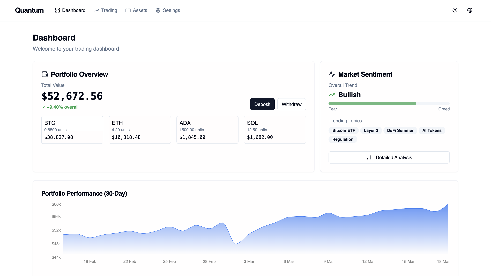

# 💹 Quantum Trading Platform



🚀 **Live Demo:** [Quantum Trading Platform](https://basit-dev-de.github.io/quantum-trading-platform)

## 📌 Overview

The **Quantum Trading Platform** is an advanced financial tool designed to analyze market trends, execute trades efficiently, and provide real-time data visualization. Built for traders and investors, it leverages **AI-powered insights** and **automated trading strategies** to optimize decision-making.

## ✨ Features

- ✅ **Live Market Data** – Fetches real-time stock and cryptocurrency prices.
- 📈 **AI-Powered Trading Insights** – Uses machine learning models to analyze trends.
- 📊 **Interactive Charts & Data Visualization** – Presents market movements dynamically.
- 🔔 **Custom Alerts & Notifications** – Notifies users of price changes and signals.
- 🚀 **Built with React & TypeScript** – Ensures performance, scalability, and maintainability.
- 🔥 **API Integration** – Connects with financial APIs for accurate, up-to-date data.

## 🛠 Tech Stack

### **Frontend**

- **Languages**: TypeScript, JavaScript (ES6+)
- **Frameworks & Libraries**: React.js, Vite
- **Styling**: Tailwind CSS, CSS-in-JS (Styled Components, Emotion CSS)
- **Charting & Data Visualization**: Recharts, Chart.js

### **State Management & Data Fetching**

- Redux Toolkit, React Query, RTK Query
- Apollo Client (GraphQL), REST APIs

### **AI & Automation**

- **Machine Learning Models**: AI-powered trading insights & predictions
- **Automation**: n8n workflows for alerts & notifications

### **Testing & Dev Tools**

- Jest, React Testing Library, Cypress
- GitHub Actions, Docker, Vercel

### **APIs & Data Sources**

- Financial Market APIs for real-time stock & crypto data
- OpenAI for AI-driven insights

## 📦 Installation & Setup

Clone the repository and install dependencies:

```sh
git clone https://github.com/basit-dev-de/quantum-trading-platform.git
cd quantum-trading-platform
npm install
```

### 🚀 Run the Application

```sh
npm run dev
```

## 🤝 Contribution

Contributions are welcome! Feel free to fork the repo and submit a pull request.

## 📬 Connect with Me

- **GitHub:** [basit-dev-de](https://github.com/basit-dev-de)
- **Portfolio:** [Standout Dev Experience](https://basit-dev.com)
- **Email:** [basit.ali@toptal.com](mailto:basit.ali@toptal.com)

🚀 **Optimize your trading strategies with the Quantum Trading Platform!**
